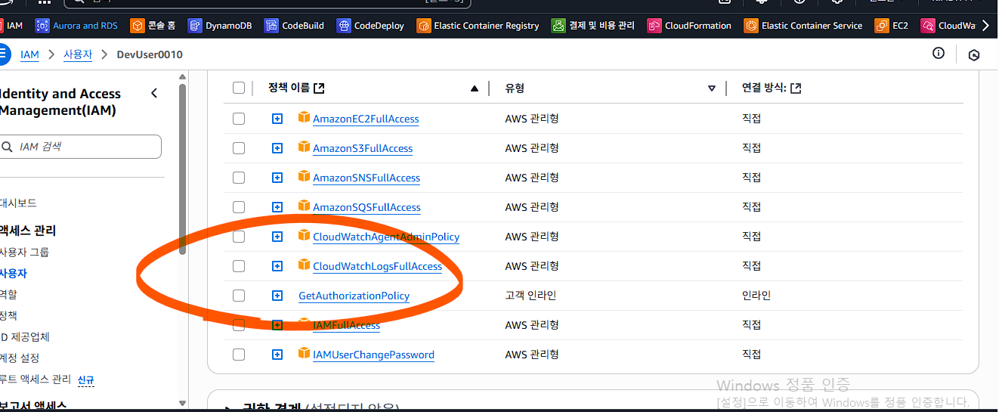
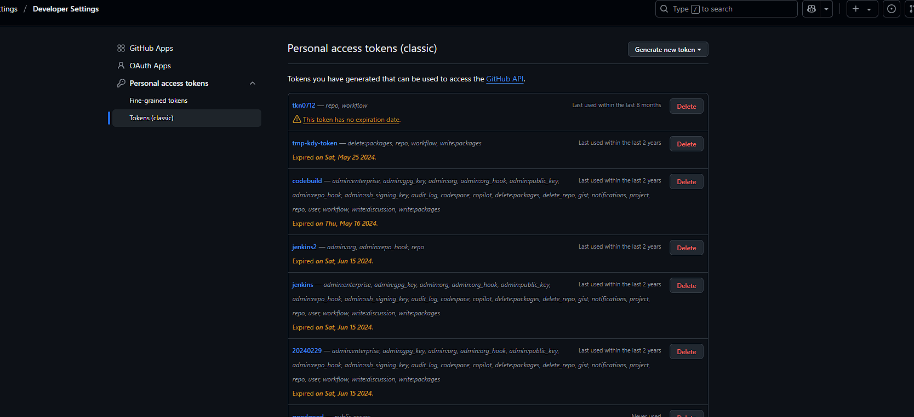
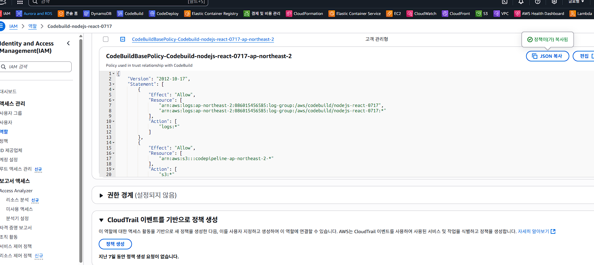
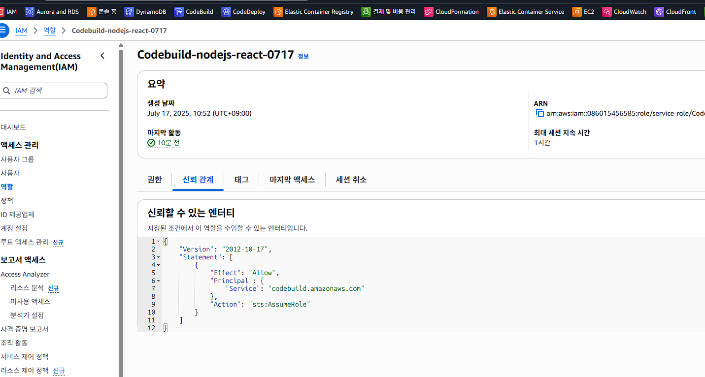
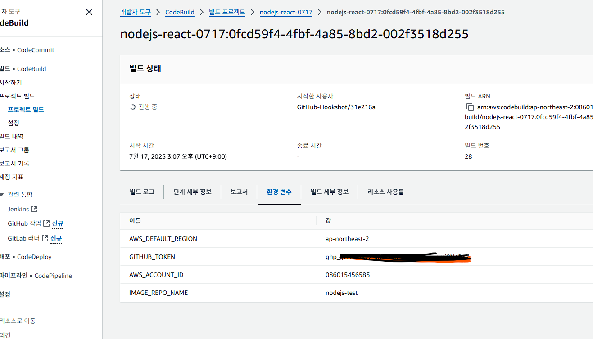

## nvm 설치
## nvm install 18
## nvm use 18
## nvm ls

## npm outdated

## npm start
## serve -s build

## admin2 / 1
## admin / 111111

## SSL 오류
## export NODE_OPTIONS=--openssl-legacy-provid

## npm audit fix --force

## npm run build

## Node.js     | v18.12.0 |
## NPM         | v8.19.2  |

## BackEnd 구동

[심플 홈페이지 Backend](https://github.com/eGovFramework/egovframe-template-simple-backend.git) 소스를 받아 구동한다.

## FrontEnd 구동

# node modules를 설치해 준다.
npm install
```

### 2. 백엔드 프로젝트 설정

구동된 BackEnd 서버의 URL을 본 어플리케이션의 .env.development 파일의 REACT_APP_EGOV_CONTEXT_URL에 설정해 준다.
(단, 개발환경에서는 사용하는 환경변수 정보는 .env.development, build 시 사용하는 환경변수는 .env.production 에 기입해 준다.)

```bash
# .env.development 예시
REACT_APP_EGOV_CONTEXT_URL=localhost:8888
```

##
docker run -it --rm --entrypoint sh egovreactnuclear


## CodeBuild 를 통한 연동
https://chatgpt.com/share/6878558a-6260-8007-ac40-a52d0c9d2cd8

## AWS CLI 로 ECR 로그인 테스트
aws ecr get-login-password --region ap-northeast-2
## Error
An error occurred (AccessDeniedException) when calling the GetAuthorizationToken operation: User: arn:aws:iam::086015456585:user/DevUser0010 is not authorized to perform: ecr:GetAuthorizationToken on resource: * because no identity-based policy allows the ecr:GetAuthorizationToken action

## IAM 추가


aws ecr get-login-password --region ap-northeast-2 `
| docker login --username AWS --password-stdin 086015456585.dkr.ecr.ap-northeast-2.amazonaws.com

## 권한문제로 github 연동 토큰 생성
https://github.com/settings/tokens

## 토큰 생성



## final
1. CodeBuild에서 React 프로젝트를 빌드하고 Nginx 기반 도커 이미지 생성
2. ECR에 푸시된 이미지를 기반으로:
2.1 EC2 인스턴스 시작
2.2 AMI 생성
2.3 시작 템플릿 생성
2.4 Auto Scaling 그룹 구성
2.5 ALB 생성 및 Auto Scaling 연결
2.6 최종적으로 ALB 주소를 통해 2개의 EC2 인스턴스로부터 로드밸런싱되는 정적 홈페이지 제공


## IAM 권한
{
    "Version": "2012-10-17",
    "Statement": [
        {
            "Effect": "Allow",
            "Resource": [
                "arn:aws:logs:ap-northeast-2:086015456585:log-group:/aws/codebuild/nodejs-react-0717",
                "arn:aws:logs:ap-northeast-2:086015456585:log-group:/aws/codebuild/nodejs-react-0717:*"
            ],
            "Action": [
                "logs:*"
            ]
        },
        {
            "Effect": "Allow",
            "Resource": [
                "arn:aws:s3:::codepipeline-ap-northeast-2-*"
            ],
            "Action": [
                "s3:*"
            ]
        },
        {
            "Effect": "Allow",
            "Action": [
                "codebuild:*"
            ],
            "Resource": [
                "arn:aws:codebuild:ap-northeast-2:086015456585:report-group/nodejs-react-0717-*"
            ]
        },
        {
            "Effect": "Allow",
            "Action": [
                "ecr:*"
            ],
            "Resource": "*"
        },
        {
            "Effect": "Allow",
            "Action": [
                "ec2:*",
                "elasticloadbalancing:*",
                "autoscaling:*",
                "iam:PassRole",
                "logs:*",
                "cloudwatch:*"
            ],
            "Resource": "*"
        }
    ]
}



## 신뢰관계


## 환경변수
